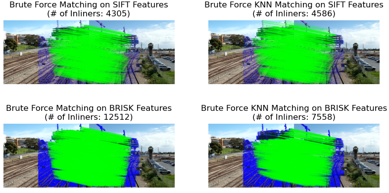

# Multi-Depth-Multi-Camera-Stitching

## Project Description

This submission consists of various methods for video stitching from multi-cameras to generate a real-time overview panorama video. 

<div align=center>

</div>

## Files Description
    .
    ├── Result                        # Folder for Animation and Image Demonstrations
    ├── stitch
    |      ├─── __init__.py
    |      ├─── ImageStitch.py        # Define the Image and Stitch class
    |      ├─── PositioningSystem.py  # Transformation Function from Local Image to Global Image
    |      └─── utils.py              # Basic functions for stitching
    |
    ├── feature_extraction_test.py    # Image Preprocessing and Feature Extraction
    ├── feature_matching_test.py      # Feature Matching and Inliers Estimation
    ├── ROIs_matching_test.py         # Feature Matching within multiple corresponding ROIs
    ├── panorama_test.py              # Generate panorama image for one frame
    ├── PositioningSystem_Test.py     # Test Script for Visualizing the Positioning System on Hard-Coded Points
    ├── stitch_custom.py              # Script for Real-time Video Stitching using generalized stitching function with stitching params input
    ├── stitch_custom_old.py          # Script for Real-time Video Stitching using different functions for each farm
    ├── .gitignore
    ├── LICENSE
    └── README.md

- `feature_extraction_test.py` - Apply Histogram Equalization for image preprocessing, then extract the SIFT, BRISK and ORB features from the image for comparison
- `feature_matching_test.py` - Apply Brute-Force Matching and KNN Matching methods for all features from two images, then apply RANSAC to estimate the Inlier Matches
- `ROIs_matching_test.py` - Apply Brute-Force Matching and KNN Matching methods for features within the target corresponding Range of Interests(ROIs). The filtered features in one region can only match to the specific region in another image. Match multiple corresponding areas separately for two images, then apply RANSAC to estimate the Inlier Matches
- `panorama_test.py` - Stitch the new image with input stitching combination, using Perspective Transform to stitch the left whole area and the right whole area
- `ImageStitch.py` - Define the `Image` class which combines properties and functions for feature processing on one image, and `Stitch` class which combines properties and functions for matches and features on a pair of images
- `stitch_custom.py` - Given the undistortion videos of multiple cameras, utilize the estimated homography parameters generated from `panorama_test.py` to stitch the image of every frame to create a panorama video
- `PositioningSystem.py` - Define the function for point transformation and box transformation based on the `trans_params.json` files. It transforms the local coordinates of individual camera to the global coordinates.
- `PositioningSystem_Test.py` - Test the positoning system of three farms by visualizing the panorama results of position transformation from each camera

## Usage
### Feature Extraction
- Image Feature Extraction Test: Extract three kinds of features from the input image and visualize the result
```bash
    $ python feature_extraction_test.py
```
<div align="center">

<br/>
Figure 1  Feature Extraction Comparison
</div>

### Feature Matching
- Feature Matching Test: Match the features with BF/KNN methods. Select suitable matching method based on the Inliers Result
```bash
    $ python feature_matching_test.py
```
<div align="center">

<br/>
Figure 2  Inlier Matches with BF/KNN Matching Methods 
</div>

- ROIs Matching Test: Match the features within corresponding areas to avoid wrong matches across different regions. The number of inliers has slightly increased because of the Separate Region Processing
```bash
    $ python ROIs_matching_test.py
```
<div align="center">

<br/>
Figure 3  Increased Inlier Matches by ROIs corresponding Matching 
</div>

- Video Stitching Test: Stitch the input videos to generate a panorama video
```
    $ python stitch_custom.py -ivid /PATH/TO/VIDEO/GROUP -hpp /PATH/TO/HOMO/PARAMS/FILE -spp /PATH/TO/STITCH/PARAMS/FILE --farm_name FARM_NAME
```
- Image Stitching Test: Stitch the images at the same frame from all cameras to generate a panorama image
```
    $ python panorama_test.py
```