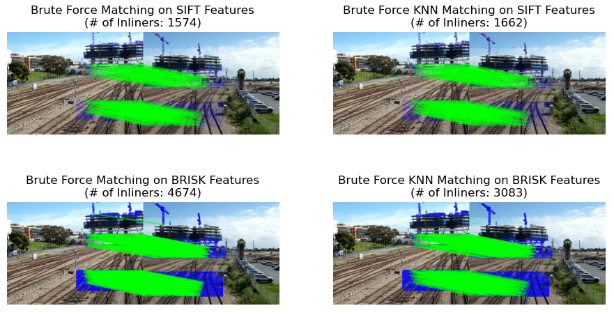

# Multi-Depth-Multi-Camera-Stitching

## Project Description

This repository consists of various methods for video stitching from multi-cameras to generate a real-time overview panorama video/image. Most of scripts are written by Python. 

<div align=center>

</div>

## Files Description
```
.
├── Result                      # Animation and Stitched Image Demonstrations
├── stitch
|    ├─── ImageStitch.py        # Define the Image and Stitch class
|    ├─── PositioningSystem.py  # Transformation Function from Local to Global Image
|    └─── utils.py              # Basic functions for stitching
├── scripts
|    ├─── feature_extraction_test.py    # Image Preprocessing and Feature Extraction
|    ├─── feature_matching_test.py      # Feature Matching and Inliers Estimation
|    ├─── ROIs_matching_test.py         # Feature Matching within corresponding ROIs
|    ├─── stitch.py                     # Directly Stitch Images (Classic Method)
|    └─── utils.py              # Basic functions for stitching
| 
├── panorama_test.py              # Multiple Stitching for Panorama Image
├── PositioningSystem_Test.py     # Test Script for Visualizing the Positioning System on Hard-Coded Points
├── stitch_custom.py              # Script for Real-time Video Stitching using generalized stitching function with stitching params input
├── stitch_custom_old.py          # Script for Real-time Video Stitching using different functions for each farm
├── undistortion_stitch_test.py   # Stitch Images using original features before undistortion 
├── .gitignore
├── LICENSE
└── README.md
```

- `feature_extraction_test.py` - Apply Histogram Equalization for image preprocessing, then extract the SIFT, BRISK and ORB features from the image for comparison

- `feature_matching_test.py` - Apply Brute-Force Matching and KNN Matching methods for all features from two images, then apply RANSAC to estimate the Inlier Matches

- `ROIs_matching_test.py` - Apply Brute-Force Matching and KNN Matching methods for features between corresponding Range of Interests(ROIs). The filtered features in one region can only match to the specific region in another image. Match multiple corresponding areas separately for two images, then apply RANSAC to estimate the Inlier Matches

- `stitch.py` - Directly perform image stitching using a homography matrix estimated by matching inliers.

- `undistortion_stitch_test.py` - The features generated from the calibrated images may be unreal due to image stretching or compression in undistortion process. This script makes use of the initial features from original fisheye images to estimate the homography matrix, then perform the image stitching on undistortion images

- `panorama_test.py` - Stitch the new input image with the stitched image from the last step, and perform Perspective Transform to correct the output stitched image for better visualization

- `ImageStitch.py` - Define the `Image` class which combines properties and functions for feature processing on one image, and `Stitch` class which combines properties and functions for matches and features on a pair of images

- `stitch_custom.py` - Given the undistortion videos of multiple cameras, utilize the estimated homography parameters generated from `panorama_test.py` to stitch the image of every frame to create a panorama video

- `PositioningSystem.py` - Define the function for point transformation and box transformation based on the `trans_params.json` files. It transforms the local coordinates of individual camera to the global coordinates.

- `PositioningSystem_Test.py` - Test the positoning system of three farms by visualizing the panorama results of position transformation from each camera
----
## Usage
### Feature Extraction
- **Image Feature Extraction Test**: Extract various features (SIFT, BRISK, ORB) from input images and visualize results
    ```bash
    $ ./main.sh -t feature_extraction $INPUT_IMAGE
    ```
<div align="center">

<br/>
Figure 1: Feature Extraction Comparison
</div>

### Feature Matching
- **Feature Matching Test**: Match the features with BF/KNN methods. Select suitable matching method based on the Inliers Result
    ```bash
    $ ./main.sh -t feature_matching -img1 $INPUT_IMAGE1 -img2 $INPUT_IMAGE2
    ```
</br>

- **ROIs Matching Test**: Match the features within corresponding areas to avoid wrong matches across different regions. As a result of the Separate Region Processing, false matches and computation time will be effectively reduced, and the number of correct matching inliers will increase.
    ```bash
    $ ./main.sh -t roi_matching -img1 $INPUT_IMAGE1 -img2 $INPUT_IMAGE2
    ```
<div align="center">


<br/>
Figure 2 (Left): Matching Inliers from All Features 

Figure 3 (Right): Matching Inliers with Corresponding Region of Interests

</div>

### Image Stitching
- **Direct Stitching Test**: Extract the SIFT features within ROIs from input images and match the corresponding ROIs' features between candidate images. Then perform image stitching using a homography matrix estimated by the output matching inliers.
    ```bash
    $ ./main.sh -t stitch -img1 $INPUT_IMAGE1 -img2 $INPUT_IMAGE2
    ```
<div align="center">

<br/>
Figure 4  Exmaple Stitched Image
</div>
</br>

- **Undistortion Stitching Test**: Stitch Undistorted Images using their original real features to estimate homography matrix
```bash
    $ python undistortion_stitch_test.py
```
<div align="center">

<br/>
Figure 5  Increased Matching Inliers by ROIs corresponding Matching on Original Distorted Images
</div>
<br/>

> This module requires original distorted images and camera calibration parameters for undistortion stitchingprocess.

<br/>

- **Multiple Stitching Test**: Stitch Multiple Images in order to obtain a Panorama Image 
```bash
    $ python panorama_test.py
```
<div align="center">

<br/>
Figure 6  Stitched Panorama Result (Dataset: APAP-conssite)
</div>


### Video Stitching

- Video Stitching Test: Stitch the input videos to generate a panorama video
```
    $ python stitch_custom.py -ivid /PATH/TO/VIDEO/GROUP -hpp /PATH/TO/HOMO/PARAMS/FILE -spp /PATH/TO/STITCH/PARAMS/FILE --farm_name FARM_NAME
```
- Image Stitching Test: Stitch the images at the same frame from all cameras to generate a panorama image
```
    $ python panorama_test.py
```